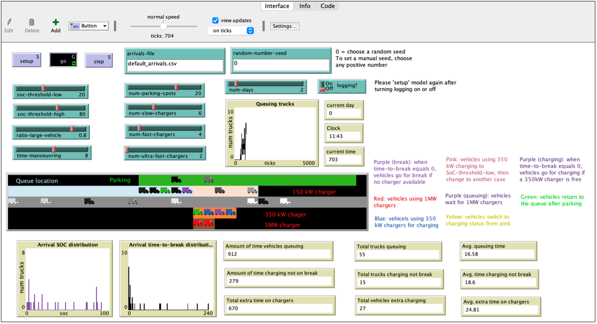

# Summary

Road transport contributes to one-fifth of global greenhouse gas emissions [@santos2017road], with a third attributed to road freight transport [@ge4charts]. Despite accounting for less than 5% of road vehicles in the EU, Heavy Goods Vehicles (HGVs) are responsible for approximately a quarter of the total CO2 emissions from road transport [@danese2021electrical]. The transition to electric Heavy Goods Vehicles (eHGVs) marks a paradigm shift in the transport sector, offering the promise of cleaner, more efficient, and affordable transportation solutions [@shoman2023battery] [@al2021charging]. However, their adoption introduces significant challenges in the development of charging infrastructure tailored to their specific requirements. A key challenge in the development and deployment of specialised charging stations lies in the technical and behavioural uncertainties associated with eHGV charging. From a technical perspective, eHGVs often require high-power charging infrastructure to accommodate their larger battery capacities and faster charging needs compared to conventional passenger vehicles [@speth2022public]. Moreover, the charging behaviour for eHGV drivers is complex, especially considering variations in the remaining vehicle range required to reach a destination and the duration of journey in mileage. To address these issues, the authors has developed an agent-based model of a single charging site that simulates theoretical eHGV driver charging behaviours and allows for experiments with different charging infrastructure configurations. It incorporates a priori drivers’ charging preferences, charger power capacities, battery sizes, and regulatory constraints governing truck operations. Through the utilization of eHGV-charging modelling (CM), users can interact with various parameters and observe how adjustments to these variables influence crucial output metrics. These metrics include time spent queuing, charging outside of break times and charger utilization efficiency. Such insights are valuable for designing a nationwide charging network, contributing to more effective emission reduction strategies. 

# Statement of need

In the context of modelling eHGV charging, understanding the requirements of the charging infrastructure is imperative for accurately capturing charging behaviour dynamics. These behaviours are influenced by factors like arrival patterns, charger availability, and the state of charge (SoC) upon arrival of trucks. In eHGV-CM, eHGVs are represented as individual agents in an agent-based model (ABM), each equipped with unique behaviours, preferences, and decision-making capabilities. Variables such as arrival battery state of charge (SoC) and time until the next mandated break have been integrated into the drivers' decision-making processes. This integration enables the simulation of scenarios wherein eHGVs dynamically adapt their charging behaviour in response to varying battery charge levels and imminent operational constraints [@menter2023long; @karlsson2023agent]. Moreover, this approach enables the depiction of real-world complexities, including diverse vehicle arrival times and charging demand patterns. 

The resulting level of granularity facilitates the exploration of complex interactions among eHGVs and charging infrastructures, thereby facilitating the identification of optimal charging strategies, infrastructure configurations, and policy interventions. By simulating these interactions within a virtual environment, we gain valuable insights into the impact of different charging infrastructure designs on system performance, efficiency, and overall sustainability. This will help policymakers, planners, and industry stakeholders make informed decisions and to optimise the deployment and operation of eHGV charging infrastructure as it starts to be rolled out nationally. Our current focus is on EU-specific vehicle availability and driver regulations, but the model is broadly generalisable to similar jurisdictions by altering a few key variables (such as the maximum driving time permitted before mandatory rest breaks or the potential maximum power of charging facilities).

# Introduction

The eHGV-CM is implemented using NetLogo , a popular, open-source piece of software that is used widely in the development of agent-based models. We employ a hypothetical synthetic population of agents to represent individual eHGVs. Each vehicle is characterized by specific attributes, including battery capacity, arrival SoC, time until next break, time of arrival, etc. Additionally, eHGVs are equipped with either a 250 kWh or 550 kWh battery pack as these are currently the most commonly-available configurations [@liimatainen2019potential].

It is assumed that a mandatory break of 45 minutes is required after 4.5 hours of continuous driving, in accordance with the regulations outlined in Regulation (EC) No 561/2006 of the European Union [@menter2023long]. The charging station is equipped with three types of chargers: ultra-fast (1000 kW), fast (350 kW), and slow (150 kW). Additionally, a dedicated parking area without charging facilities is also integrated.

Given the absence of empirical charging data for eHGVs, we simulate the charging behaviour of future eHGVs based on the following assumptions.  It is important to note that this simulation considers only a single service station and does not account for a broader charging network, which may influence driver behaviour. To model operational behaviour, we simulate vehicle arrivals at the charging station and do not, yet, consider the journey to and from the station. Upon arrival and taking into consideration the arrival SoC and time-to-break, nine cases are considered, see Table 1: 

Table 1 Case numbers for the nine combinations of SoC time until mandated rest break (‘time-to-break’)

| Charge Level     | Rest Break Imminent| Rest Break Soon| Rest Break Distant|
|------------------|--------------------|-----------------|--------------------|
| Low Charge       | 1                  | 2               | 3                  |
| Medium Charge    | 4                  | 5               | 6                  |
| High Charge      | 7                  | 8               | 9                  |

As eHGV adoption is still in its infancy, there is very limited data that can be used to underpin the behaviours of the truck drivers in the model. Therefore, these behaviours are exploratory and are intended to help the user to understand the impact of different driver decisions. Specific driver behaviours are unique to each case, but broadly they can be categorised into the following four behaviour groups:
a) Trucks with low charge (cases 1, 2 & 3) will utilize any available chargers upon entering the charging station, regardless of type, prioritising chargers with the highest power. If no charger is available, they will join a queue for the chargers. While in the queue, if the time-to-break reaches 0, the driver will park for 45 minutes and then return to the queue to wait for an available charger. 
b) Trucks needing immediate breaks (cases 4 & 7) will similarly use any available chargers, regardless of type. They will only join the queue if there are no other vehicles already in the queue. If they can start charging before their rest break becomes necessary, these drivers will leave the vehicle for at least 45 minutes to conduct their break simultaneously with vehicle charging. If no chargers are available, the drivers will park for 45 minutes.
c) Trucks neither requiring urgent breaks nor immediate charging (cases 5 & 8) will only charge if a 1 MW charger is available. For trucks with medium charge (case 5), their decision to join the queue depends on whether the length of the queue exceeds the quantity of ultra-fast chargers. For trucks with high charge (case 8), the driver will leave if no 1MW charger is available.
d) Trucks with medium charge and no need for a break (case 6) will only charge with a 1 MW charger if available; otherwise, they will leave.
In addition, overnight charging behaviours are included in eHGV-CM with the assumption that any vehicle arriving at the charging station between 7 PM and 6 AM with an SOC below a certain threshold value (e.g., 80%) will charge for 9 hours if a slow charger is available. Otherwise, they will follow the behaviours outlined in the groups above based on SOC and time-to-break. The model is flexible and  allows for adjustments to the overnight charging window as new evidence becomes available. 
To understand the requirements of eHGV charging infrastructure, eHGV-CM allows for adjusting important factors such as the number of chargers for each type, parking space availability, and the threshold value of the SoC through the Graphic User Interface (GUI) as per Figure 1. The model also allows for the configuration of different arrival profiles for each case. Additionally,  eHGV-CM includes key output metrics, such as time spent queuing, time ‘wasted’ charging (i.e. charging while not on a mandatory break), and charger utilization efficiency, which are dynamically monitored.

# Conclusion and Availability

The developed eHGV-CM enables analysis of various charging infrastructure configurations. It can assist stakeholders in making informed decisions regarding infrastructure investments, deployment strategies, and policy formulations to support the widespread adoption of eHGVs. The code and documentation are hosted on a publicly available GitHub repository.

# Acknowledgements 
We acknowledge funding and support from Department for Transport.

# References
